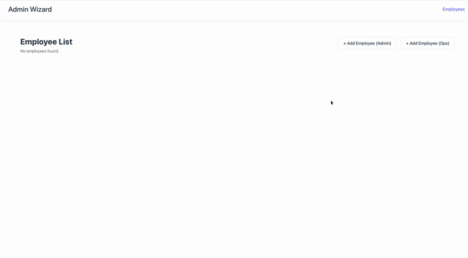

# Admin Wizard



Multi-step form application built with React, TypeScript, Vite, and Chakra UI.

## Quick Start with Docker

Requires [Docker Desktop](https://www.docker.com/products/docker-desktop/).

```bash
# Start all services (frontend + APIs)
npm run docker:start
# or
yarn docker:start

# Stop services
npm run docker:stop
```

Access at:
- Frontend: http://localhost:5173
- API Step 1: http://localhost:4001
- API Step 2: http://localhost:4002

## Local Development

```bash
# Install dependencies
npm install --legacy-peer-deps

# Start API servers (in separate terminals)
npm run api:step1
npm run api:step2

# Start dev server
npm run dev
```

## Testing

```bash
# Run tests
npm test

# Run tests with UI
npm run test:ui

# Run tests once
npm run test:run
```

## Build

```bash
npm run build
```
